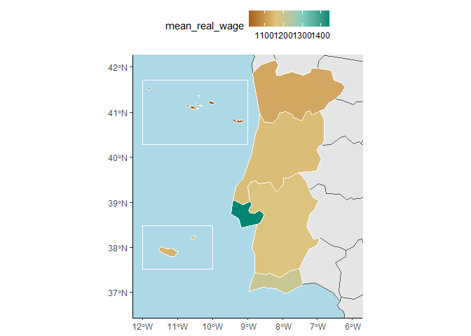

Miguel Salema

<!-- README.md is generated from README.Rmd. Please edit that file -->

# ptmap

<!-- badges: start -->
<!-- badges: end -->

`ptmap` facilitates the creation of maps of Portuguese NUTs. For now, it
only supports NUTs 2.

## Installation

You can install the development version of ptmap from
[GitHub](https://github.com/) with:

``` r
# install.packages("devtools")
devtools::install_github("Salema-DG/ptmap")
```

## Example

This is a basic example which shows you how to solve a common problem:

``` r
library(ptmap)
#> Loading required package: sf
#> Linking to GEOS 3.10.2, GDAL 3.4.1, PROJ 7.2.1; sf_use_s2() is TRUE
library(dplyr)
#> Warning: package 'dplyr' was built under R version 4.1.3
#> 
#> Attaching package: 'dplyr'
#> The following objects are masked from 'package:stats':
#> 
#>     filter, lag
#> The following objects are masked from 'package:base':
#> 
#>     intersect, setdiff, setequal, union
library(ggplot2)

data(qp_nut2_data) # load wage data from Portugal at NUT2 level

# create a tibble with only one year, 2019.
df19 <- qp_nut2_data %>%
 filter(year == 2019)

# Apply the function
map_pt_19 <- df19 %>%
 map_pt_nuts_II(main_var = mean_real_wage,
                nut2_var = nut_2_est,
                nut_var_qp = T)
```

``` r
# The output is a ggplot map that can be easily altered
map_pt_19 +
  labs(fill = "Real Average Wage") # changes the title of legend
```


